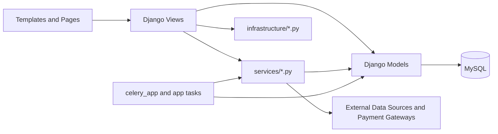

# Stock Prediction System Page Architecture

This document maps the current Django project into page flows, route groups, shared layout shells, and backend support modules.

## High-Level Architecture

```mermaid
graph TD
    A[config/urls.py] --> B[Public and HTML Apps]
    A --> C[REST/API Apps]
    A --> D[Django Admin]

    B --> B1[Dashboard Pages]
    B --> B2[Authentication]
    B --> B3[Research Calls]
    B --> B4[Portfolio]
    B --> B5[Watchlist]
    B --> B6[Market Data]
    B --> B7[Trades]
    B --> B8[Payments]
    B --> B9[Admin Panel]

    B1 --> T1[templates/home.html]
    B1 --> T2[templates/dashboard/customer_dashboard.html]
    B1 --> T3[templates/dashboard/home.html]
    B1 --> T4[templates/markets/*.html]
    B1 --> T5[templates/ipo/upcoming.html]
    B1 --> T6[templates/pro/*.html]
    B1 --> T7[templates/explore.html]
    B1 --> T8[templates/trades/dashboard.html]

    B2 --> TA[templates/authentication/*.html]
    B3 --> TB[templates/research_calls/*.html]
    B4 --> TC[templates/portfolios/portfolio.html]
    B5 --> TD[templates/watchlists/watchlist.html]
    B6 --> TE[templates/market_data/*.html]
    B7 --> TF[templates/trades/trade_list.html]
    B8 --> TG[templates/payments/membership.html]
    B9 --> TH[templates/admin_panel/**/*.html]

    T2 --> P1[partials/customer_sidebar.html]
    T2 --> P2[partials/customer_header.html]
    TH --> P3[partials/admin_sidebar.html]
    TH --> P4[partials/admin_header.html]
    T1 --> P5[partials/navbar.html]
    T1 --> P6[partials/market_ticker.html]
    T1 --> P7[partials/footer.html]

    B1 --> S1[services/recommendation_service.py]
    B1 --> S2[services/market_hero_service.py]
    B1 --> S3[services/ipo_service.py]
    B1 --> S4[services/sip_mf_etf_service.py]
    B1 --> S5[services/commodity_service.py]
    B8 --> S6[infrastructure/razorpay_client.py]

    C --> C1[api/core]
    C --> C2[api/brokers]
    C --> C3[api/notifications]
    C --> C4[api/subscriptions]
    C --> C5[api/audit]
```



## User Shells

```mermaid
graph LR
    G[Guest User] --> G1[/]
    G --> G2[/auth/login/]
    G --> G3[/auth/register/]
    G --> G4[/markets/]
    G --> G5[/calls/]

    C[Customer User] --> C1[/app/]
    C --> C2[/portfolio/]
    C --> C3[/watchlist/]
    C --> C4[/calls/live/]
    C --> C5[/markets/]
    C --> C6[/payments/membership/]
    C --> C7[/auth/profile/]

    AA[Analyst or Admin] --> A1[/calls/create/]
    AA --> A2[/calls/<id>/edit/]
    AA --> A3[/calls/<id>/]

    AD[Admin User] --> D1[/admin-panel/]
    AD --> D2[/admin-panel/calls/]
    AD --> D3[/admin-panel/users/]
    AD --> D4[/admin-panel/brokers/]
    AD --> D5[/admin-panel/subscriptions/]
    AD --> D6[/admin-panel/payments/]
    AD --> D7[/admin-panel/ipos/]
    AD --> D8[/admin-panel/commodities/]
    AD --> D9[/admin-panel/etfs/]
```

## Complete Page Graph

```mermaid
graph TD
    ROOT[/] --> LANDING[Landing Page<br/>templates/home.html]
    ROOT --> APP[/app/]
    ROOT --> MARKETS[/markets/]
    ROOT --> PROTRADES[/pro-trades/]
    ROOT --> PROBASKETS[/pro-baskets/]
    ROOT --> IPO[/ipo/]
    ROOT --> EXPLORE[/explore/]
    ROOT --> SIP[/sip/]
    ROOT --> MF[/mutual-funds/]
    ROOT --> ETF[/etf/]
    ROOT --> BONDS[/bonds/]
    ROOT --> LIQ[/liquidity/]
    ROOT --> COMMODITY[/commodity/]
    ROOT --> TDASH[/trades-dashboard/]
    ROOT --> GL[/gainers-losers/]
    ROOT --> RL[/recently-listed/]
    ROOT --> TBROKERS[/top-brokers/]
    ROOT --> TECH[/technical-analysis/]

    APP --> CUSTOMER[Customer Dashboard<br/>templates/dashboard/customer_dashboard.html]
    APP --> ADMINREDIRECT[Admin redirect to /admin-panel/]
    APP --> FALLBACK[Generic Dashboard<br/>templates/dashboard/home.html]

    MARKETS --> MKT[Market Overview<br/>templates/markets/overview_v2.html]
    PROTRADES --> PROT[Pro Trades<br/>templates/pro/pro_trades.html]
    PROBASKETS --> PROB[Pro Baskets<br/>templates/pro/baskets.html]
    IPO --> IPOT[IPO Page<br/>templates/ipo/upcoming.html]
    EXPLORE --> EXPT[Explore Page<br/>templates/explore.html]
    SIP --> SIPT[SIP Page<br/>templates/markets/sip.html]
    MF --> MFT[Mutual Funds<br/>templates/markets/mutual_funds.html]
    ETF --> ETFT[ETF Page<br/>templates/markets/etf.html]
    BONDS --> BONDST[Bonds Page<br/>templates/markets/bonds.html]
    LIQ --> LIQT[Liquidity Page<br/>templates/markets/liquidity.html]
    COMMODITY --> COMT[Commodity Page<br/>templates/markets/commodity.html]
    TDASH --> TDASHT[Trades Dashboard<br/>templates/trades/dashboard.html]
    GL --> GLT[Gainers and Losers<br/>templates/markets/gainers_losers.html]
    RL --> RLT[Recently Listed<br/>templates/markets/recently_listed.html]
    TBROKERS --> TBT[Top Brokers<br/>templates/markets/top_brokers.html]
    TECH --> TECHT[Technical Analysis<br/>templates/markets/technical_analysis.html]

    AUTH[/auth/] --> LOGIN[/auth/login/]
    AUTH --> REGISTER[/auth/register/]
    AUTH --> PROFILE[/auth/profile/]
    AUTH --> LOGOUT[/auth/logout/]
    AUTH --> PRREQ[/auth/password-reset/]
    AUTH --> PRCONF[/auth/password-reset/<uid>/<token>/]

    LOGIN --> LOGINT[templates/authentication/login.html]
    REGISTER --> REGT[templates/authentication/register.html]
    PROFILE --> PROFT[templates/authentication/profile.html]
    PRREQ --> PRREQT[templates/authentication/password_reset_request.html]
    PRCONF --> PRCONFT[templates/authentication/password_reset_confirm.html]

    CALLS[/calls/] --> CALLLIVE[/calls/ or /calls/live/]
    CALLS --> CALLCLOSED[/calls/closed/]
    CALLS --> CALLDETAIL[/calls/<id>/]
    CALLS --> CALLCREATE[/calls/create/]
    CALLS --> CALLEDIT[/calls/<id>/edit/]
    CALLS --> CALLAPPROVE[/calls/<id>/approve/]
    CALLS --> CALLPUBLISH[/calls/<id>/publish/]

    CALLLIVE --> CALLLIVET[Live Calls<br/>templates/research_calls/live_trades.html]
    CALLCLOSED --> CALLCLOSEDT[Closed Calls<br/>templates/research_calls/closed_trades.html]
    CALLDETAIL --> CALLDETAILT[Call Detail<br/>templates/research_calls/call_detail.html]
    CALLCREATE --> CALLFORM[Call Form<br/>templates/research_calls/call_form.html]
    CALLEDIT --> CALLFORM
    CALLAPPROVE --> CALLDETAIL
    CALLPUBLISH --> CALLDETAIL

    PORT[/portfolio/] --> PORTVIEW[/portfolio/]
    PORT --> PORTADD[/portfolio/add/]
    PORT --> PORTEXIT[/portfolio/<id>/exit/]
    PORTVIEW --> PORTT[Portfolio Page<br/>templates/portfolios/portfolio.html]
    PORTADD --> PORTVIEW
    PORTEXIT --> PORTVIEW

    WATCH[/watchlist/] --> WATCHVIEW[/watchlist/]
    WATCH --> WATCHADD[/watchlist/add/]
    WATCH --> WATCHREMOVE[/watchlist/<id>/remove/]
    WATCHVIEW --> WATCHT[Watchlist Page<br/>templates/watchlists/watchlist.html]
    WATCHADD --> WATCHVIEW
    WATCHREMOVE --> WATCHVIEW

    MARKET[/market/] --> IDX[/market/indices/]
    MARKET --> STOCKS[/market/stocks/]
    MARKET --> MARKETAPI[/market/api/]
    MARKET --> MARKETUPDATE[/market/update/]
    IDX --> IDXT[templates/market_data/indices.html]
    STOCKS --> STOCKST[templates/market_data/popular_stocks.html]

    TRADES[/trades/] --> TSHORT[/trades/short-term/]
    TRADES --> TMED[/trades/medium-term/]
    TRADES --> TLONG[/trades/long-term/]
    TRADES --> TFUT[/trades/futures/]
    TRADES --> TOPT[/trades/options/]
    TRADES --> TCOM[/trades/commodity/]
    TSHORT --> TRADET[templates/trades/trade_list.html]
    TMED --> TRADET
    TLONG --> TRADET
    TFUT --> TRADET
    TOPT --> TRADET
    TCOM --> TRADET

    PAY[/payments/] --> MEMBER[/payments/membership/]
    PAY --> ORDER[/payments/create-order/]
    PAY --> VERIFY[/payments/verify/]
    PAY --> WEBHOOK[/payments/webhook/]
    MEMBER --> MEMBERT[templates/payments/membership.html]

    NTFY[/api/notifications/inbox/] --> NTFYT[templates/notifications/list.html]

    ADMIN[/admin-panel/] --> ADASH[/admin-panel/]
    ADMIN --> ACALLS[/admin-panel/calls/]
    ADMIN --> ACREATE[/admin-panel/calls/create/]
    ADMIN --> ADETAIL[/admin-panel/calls/<id>/]
    ADMIN --> AEDIT[/admin-panel/calls/<id>/edit/]
    ADMIN --> ADELETE[/admin-panel/calls/<id>/delete/]
    ADMIN --> ABROKERS[/admin-panel/brokers/]
    ADMIN --> ABROKERCREATE[/admin-panel/brokers/create/]
    ADMIN --> ABROKERDETAIL[/admin-panel/brokers/<id>/]
    ADMIN --> ABROKEREDIT[/admin-panel/brokers/<id>/edit/]
    ADMIN --> AUSERS[/admin-panel/users/]
    ADMIN --> AUSERDETAIL[/admin-panel/users/<id>/]
    ADMIN --> AUSEREDIT[/admin-panel/users/<id>/edit/]
    ADMIN --> AUSERDELETE[/admin-panel/users/<id>/delete/]
    ADMIN --> APORTS[/admin-panel/portfolios/]
    ADMIN --> APORTDETAIL[/admin-panel/portfolios/<id>/]
    ADMIN --> APORTDELETE[/admin-panel/portfolios/<id>/delete/]
    ADMIN --> AWATCH[/admin-panel/watchlists/]
    ADMIN --> AWATCHDETAIL[/admin-panel/watchlists/<id>/]
    ADMIN --> AWATCHDELETE[/admin-panel/watchlists/<id>/delete/]
    ADMIN --> ASUBS[/admin-panel/subscriptions/]
    ADMIN --> ASUBCREATE[/admin-panel/subscriptions/create/]
    ADMIN --> ASUBEDIT[/admin-panel/subscriptions/<id>/edit/]
    ADMIN --> ASUBDELETE[/admin-panel/subscriptions/<id>/delete/]
    ADMIN --> APAYMENTS[/admin-panel/payments/]
    ADMIN --> APAYDETAIL[/admin-panel/payments/<id>/]
    ADMIN --> AIPOS[/admin-panel/ipos/]
    ADMIN --> AIPOCREATE[/admin-panel/ipos/create/]
    ADMIN --> AIPOEDIT[/admin-panel/ipos/<id>/edit/]
    ADMIN --> AIPODELETE[/admin-panel/ipos/<id>/delete/]
    ADMIN --> ACOMMODITIES[/admin-panel/commodities/]
    ADMIN --> ACOMCREATE[/admin-panel/commodities/create/]
    ADMIN --> ACOMEDIT[/admin-panel/commodities/<id>/edit/]
    ADMIN --> ACOMDELETE[/admin-panel/commodities/<id>/delete/]
    ADMIN --> AETFS[/admin-panel/etfs/]
    ADMIN --> AETFSCREATE[/admin-panel/etfs/create/]
    ADMIN --> AETFSEDIT[/admin-panel/etfs/<id>/edit/]
    ADMIN --> AETFSDELETE[/admin-panel/etfs/<id>/delete/]

    ADASH --> ADASHT[templates/admin_panel/dashboard.html]
    ACALLS --> ACALLST[templates/admin_panel/calls/list.html]
    ACREATE --> ACALLFORM[templates/admin_panel/calls/form.html]
    ADETAIL --> ACALLDETAILT[templates/admin_panel/calls/detail.html]
    AEDIT --> ACALLFORM
    ADELETE --> ACALLDELETET[templates/admin_panel/calls/confirm_delete.html]
    ABROKERS --> ABROKERLISTT[templates/admin_panel/brokers/list.html]
    ABROKERCREATE --> ABROKERFORMT[templates/admin_panel/brokers/form.html]
    ABROKERDETAIL --> ABROKERDETAILT[templates/admin_panel/brokers/detail.html]
    ABROKEREDIT --> ABROKERFORMT
    AUSERS --> AUSERLISTT[templates/admin_panel/users/list.html]
    AUSERDETAIL --> AUSERDETAILT[templates/admin_panel/users/detail.html]
    AUSEREDIT --> AUSERFORMMISSING[Missing template reference<br/>admin_panel/users/form.html]
    AUSERDELETE --> AUSERDELETEMISSING[Missing template reference<br/>admin_panel/users/confirm_delete.html]
    APORTS --> APORTLISTT[templates/admin_panel/portfolios/list.html]
    APORTDETAIL --> APORTDETAILT[templates/admin_panel/portfolios/detail.html]
    APORTDELETE --> APORTDELETET[templates/admin_panel/portfolios/confirm_delete.html]
    AWATCH --> AWATCHLISTT[templates/admin_panel/watchlists/list.html]
    AWATCHDETAIL --> AWATCHDETAILT[templates/admin_panel/watchlists/detail.html]
    AWATCHDELETE --> AWATCHDELETET[templates/admin_panel/watchlists/confirm_delete.html]
    ASUBS --> ASUBLISTT[templates/admin_panel/subscriptions/list.html]
    ASUBCREATE --> ASUBFORMT[templates/admin_panel/subscriptions/form.html]
    ASUBEDIT --> ASUBFORMT
    ASUBDELETE --> ASUBDELETET[templates/admin_panel/subscriptions/confirm_delete.html]
    APAYMENTS --> APAYLISTT[templates/admin_panel/payments/list.html]
    APAYDETAIL --> APAYDETAILT[templates/admin_panel/payments/detail.html]
    AIPOS --> AIPOLISTT[templates/admin_panel/ipos/list.html]
    AIPOCREATE --> AIPOFORMT[templates/admin_panel/ipos/form.html]
    AIPOEDIT --> AIPOFORMT
    AIPODELETE --> AIPODELETET[templates/admin_panel/ipos/confirm_delete.html]
    ACOMMODITIES --> ACOMLISTT[templates/admin_panel/commodities/list.html]
    ACOMCREATE --> ACOMFORMT[templates/admin_panel/commodities/form.html]
    ACOMEDIT --> ACOMFORMT
    ACOMDELETE --> ACOMDELETET[templates/admin_panel/commodities/confirm_delete.html]
    AETFS --> AETFLISTT[templates/admin_panel/etfs/list.html]
    AETFSCREATE --> AETFFORMT[templates/admin_panel/etfs/form.html]
    AETFSEDIT --> AETFFORMT
    AETFSDELETE --> AETFDELETET[templates/admin_panel/etfs/confirm_delete.html]
```

## Page-to-App Mapping

| Area | Route Prefix | App | Primary Templates | Notes |
|---|---|---|---|---|
| Public landing | `/` | `apps.dashboard` | `home.html` | Redirects authenticated users to `/app/` |
| Dashboard | `/app/` | `apps.dashboard` | `dashboard/customer_dashboard.html`, `dashboard/home.html` | Admin users are redirected to `/admin-panel/` |
| Market content | `/markets/`, `/sip/`, `/mutual-funds/`, `/etf/`, `/bonds/`, `/liquidity/`, `/commodity/`, `/gainers-losers/`, `/recently-listed/`, `/top-brokers/`, `/technical-analysis/` | `apps.dashboard` | `templates/markets/*.html` | Uses service layer heavily |
| IPO | `/ipo/` | `apps.dashboard` | `ipo/upcoming.html` | Driven by `services/ipo_service.py` |
| Explore | `/explore/` | `apps.dashboard` | `explore.html` | Static discovery page |
| Auth | `/auth/` | `apps.authentication` | `templates/authentication/*.html` | Login, register, profile, password reset |
| Research calls | `/calls/` | `apps.research_calls` | `templates/research_calls/*.html` | Includes live, closed, detail, create, edit |
| Portfolio | `/portfolio/` | `apps.portfolios` | `templates/portfolios/portfolio.html` | Add and exit are action endpoints |
| Watchlist | `/watchlist/` | `apps.watchlists` | `templates/watchlists/watchlist.html` | Add and remove are action endpoints |
| Market data | `/market/` | `apps.market_data` | `templates/market_data/*.html` | Mixed HTML and JSON endpoints |
| Trade categories | `/trades/` | `apps.trades` | `templates/trades/trade_list.html` | Six category URLs reuse one template |
| Membership | `/payments/` | `apps.payments` | `templates/payments/membership.html` | Payment verification and webhook are backend endpoints |
| Notifications | `/api/notifications/inbox/` | `apps.notifications` | `templates/notifications/list.html` | HTML page is mounted under API prefix |
| Admin panel | `/admin-panel/` | `apps.admin_panel` | `templates/admin_panel/**/*.html` | Dedicated admin shell and CRUD screens |

## Backend Support Layers



## Important Findings From The Analysis

- The actual main user entrypoints are `/`, `/app/`, `/calls/`, `/portfolio/`, `/watchlist/`, `/markets/`, and `/admin-panel/`.
- `templates/base.html` swaps layout shells based on authentication state, while admin pages use `templates/admin_panel/base.html`.
- The dashboard app acts as the main page aggregator for both guest and customer flows.
- A few routes are action endpoints rather than pages: portfolio add/exit, watchlist add/remove, payment order/verify/webhook, market update, and several API endpoints.
- `apps.notifications` mixes HTML and API under `/api/notifications/`, which is unusual but currently intentional.
- `apps.admin_panel.views` references `admin_panel/users/form.html` and `admin_panel/users/confirm_delete.html`, but those template files are not present in `templates/admin_panel/users/`.
